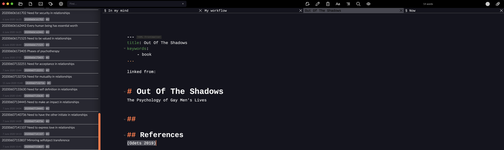
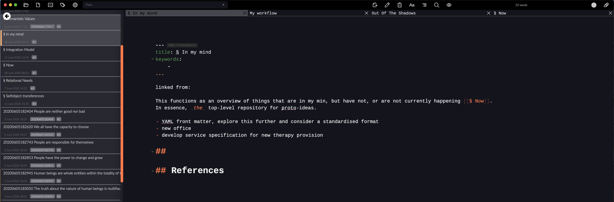
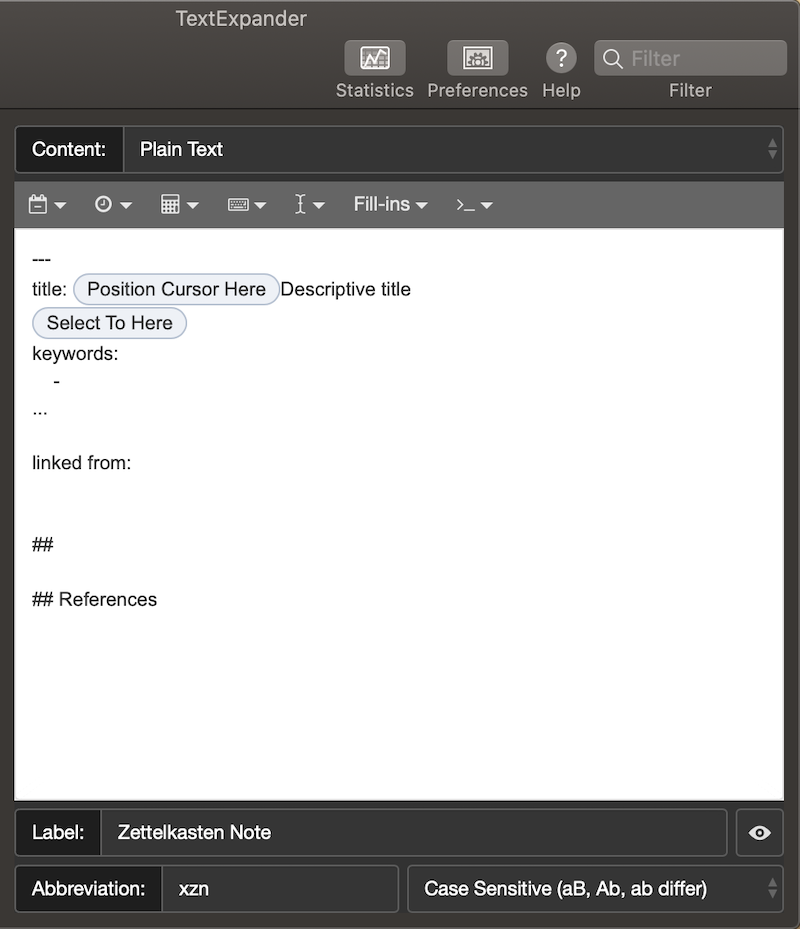
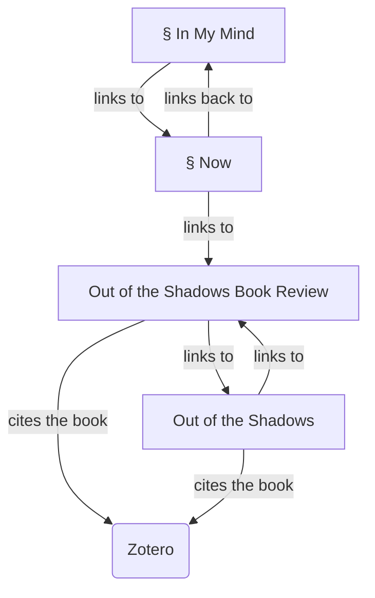

Following some discussions over on the [Zettlr forum](https://forum.zettlr.com/discussions) I'm attempting to write up my workflow in some kind of coherent fashion.  In the spirit of "working with the garage door open" I'm using a task that I'm working on right now.  In stepping through the process, then my workflow will become clearer (to me, as well as you).  As the genesis of this was to expand on how I use [Zettlr](https://www.zettlr.com), I hope that this will also be adequately addressed and prove helpful for others.  On this note, I am not in any way an expert on Zettlr, or [Zettelkasten](https://zettelkasten.de).  I'm relatively new to this way of working and learning as I go, but so far it seems to be helping me a lot.

## The task

I'm writing a book review for a magazine from one of my professional bodies.  This is my starting point, from which everything else flows.

### Create a new note for the book

This is *not* the note that will become the review, but will instead come to contain either a summary, or an index of more detailed notes about the book.  I want to make a link here between the note about the book, and the book itself, but this needs a little more work elsewhere first.

### Create a new note for the book review

I know that I'm going to need another new note, so may as well make it now.  This is what will become the book review.  Yes, I write it all in markdown, using Zettlr.  For a long time I used LibreOffice to write everything, mostly because of the number of people who required .docx format files.  But Zettlr is now my go-to choice.

In this case, the title is the name of the book, and keywords 'book_review' because it's a book review, 'xyz' for my eventual personal publication site, and 'BACP' for the professional publication.

### Add some links

I link the general note about the book, and the review to each other.  I also link (or index if you prefer) the note for the review from (or in) \[[§ Now]], as it is something that I am currently working on.

I still need to make some connection to the book itself, which comes next.

#### Organising notes

\[[§ Now]] is an index of *current* work.  These are things that I am *actually* working on, not everything that I want to do at some future time.  That bigger list of things that I'd like to do or think about is kept in \[[§ In My Mind]] so that I don't have to actually keep it all in my mind.  I think of this as a hierarchy, with \[[§ In My Mind]] being the top level, and \[[§ Now]] as a current to-do type of list.  The § at the front of the filename ensure that I can sort alphabetically and have these top-level notes at the top of my directory listing.

I am currently going with the default YYYYMMDDhhmmss.md file format within Zettlr for all note filenames.  Please be aware, I have changed my mind about this several times already, and no, I have not studiously gone back and updated all of my previous notes to reflect the latest format every time (gasp!).  If you are new to this way of working, then just start, and don't worry about everything being done 'right' straight away.  My preferred style is still evolving, as will yours.

I then use a standard format for the text (body) of the note which includes a YAML title and keywords.  I could type this in every time, but life is too short for that so I have a [TextExpander](https://textexpander.com) snippet that puts this in for me with the shortcode 'xzn' (X - my standard shortcode start, Z - Zettlr, N - note).  Again, this is an evolving concept, and updating the TextExpander snippet as my preference emerges is trivial work.  TextExpander is not open-source, but I have not found a better option so far.

## Deal with the book

It arrived in the post, and after a quick flick through I'm looking forwards to reading and reviewing it.  I want to be able to reference it, so I need to add it to my reference manager.

### Add the book to Zotero

[Zotero](https://www.zotero.org) is an excellent reference manager, and it allows you to cite from your collection in Word, LibreOffice, and (with some very minor work) Zettlr.  I usually add books by their ISBN or DOI, and then check that the auto-filled details are correct.  I use the Better Bibtex plugin which keeps a JSON version of my Zotero library always up to date.  I have already told Zettlr about this (see the Zettlr documentation for how to do this, it's very easy) which means I can now cite the book within Zettlr.

### Link the book to the notes

Now I can add the citation to the book note and the book review note.  A simple @ and I can search for and then cite the book.  Following the link will open the book entry in Zotero, and if I had a PDF version also in Zotero, I could open that.

## Notes we have so far

1. \[[§ In My Mind]] - The top level note of my life, which has a link to...
2. \[[§ Now]] - What I am currently working on.  This has a link to…
3. \[[20200628161052]] Out Of The Shadows Book Review - This is linked to the Book Note, is currently indexed in \[[§ Now]] and cites the book's entry in Zotero.  When it eventually comes out of \[[§ Now]] (because the review is completed) then this note will not be indexed anywhere else.  If I write several reviews, then I might create a Book Reviews index note.
4. \[[20200622165143]] Out Of The Shadows - This is the note about the book, and is linked to the Book Review Note.  It also cites the book from Zotero, but is *not* currently indexed anywhere.   If I end up with a lot of these then I might create a Books Index note, but for now the full-text search and the book_review tag (aka keyword) is enough for me to find it whenever I need to.

## Read the book and make notes

This might sound obvious.  But there are things to consider at this stage too.

### For physical books

As in this example, I will be making notes as I go in a separate paper notebook.  I tend to ensure that I have at least a chapter summary for every chapter, and then any specific ideas I want to capture get their own note.  This format works well for academic books, but for fiction it makes less sense so I stick to themes and specific points of interest for those.

### For PDFs

I highlight and annotate as I read, using standard MacOS Preview and iOS PDF handlers, making sure that every highlight has an associated note.  As with the paper version of this process, I end up with chapter summaries as well as notes for specific ideas.

#### Zotero and iOS

One of my few frustrations with Zotero is the lack of a native iOS app for Zotero.  Some people still have success syncing their Zotero library with the Papership app, and this still works for me, although there are numerous reports that Papership is no longer actively developed, and of this process being unreliable.  Alternatively,  you can use the [Zotfile plugin](http://zotfile.com) to manage moving documents between devices.  There is a web interface for Zotero, which works well for viewing and searching your collection, but I have not been able to use it to update highlights or notes in PDF files.

#### Extract the highlights and notes from the PDF

I use the excellent [Zotfile](http://zotfile.com) plugin for Zotero, which automates this process, creating a note in Zotero linked to the book entry in Zotero, with all of my highlights and comments in it.

## Put the notes into Zettlr

This is, after all, the point.

### Chapter summaries

I usually leave these in the Book note I created earlier.  But if they are becoming unmanageable, the book note becomes an index of the chapter summaries and whatever else I am recording.
A chapter summary may also include links to ideas or themes that appear elsewhere in my zettelkasten.  This is the beginning of making sense of the wider body of knowledge ad idea that I am creating.

### Notes for ideas

As is the Zettelkasten way, each idea (or theme) gets it's own Zettlr note, using the same template as before.  As with the Book note, I also cite the book in the idea note (with additionally page or chapter references for specificity), which keeps things tied together.
Ideas are the building blocks of my zettelkasten, and so I am likley to make connections in this new idea across different notes that already exist.  Maybe they coalesce and form a more consolidated idea or theme, maybe they spark a whole new concept (and so a whole new note).

## Write the review

Now I can begin to write the review.  I usually link any notes that i want to include in whichever section is relevant, and then gradually replace the links with the text of my review as the piece comes together.

## Tidy up

When it's done, and therefor no-longer a current piece of work, I will remove the book review note from the \[[§ Now]] note.